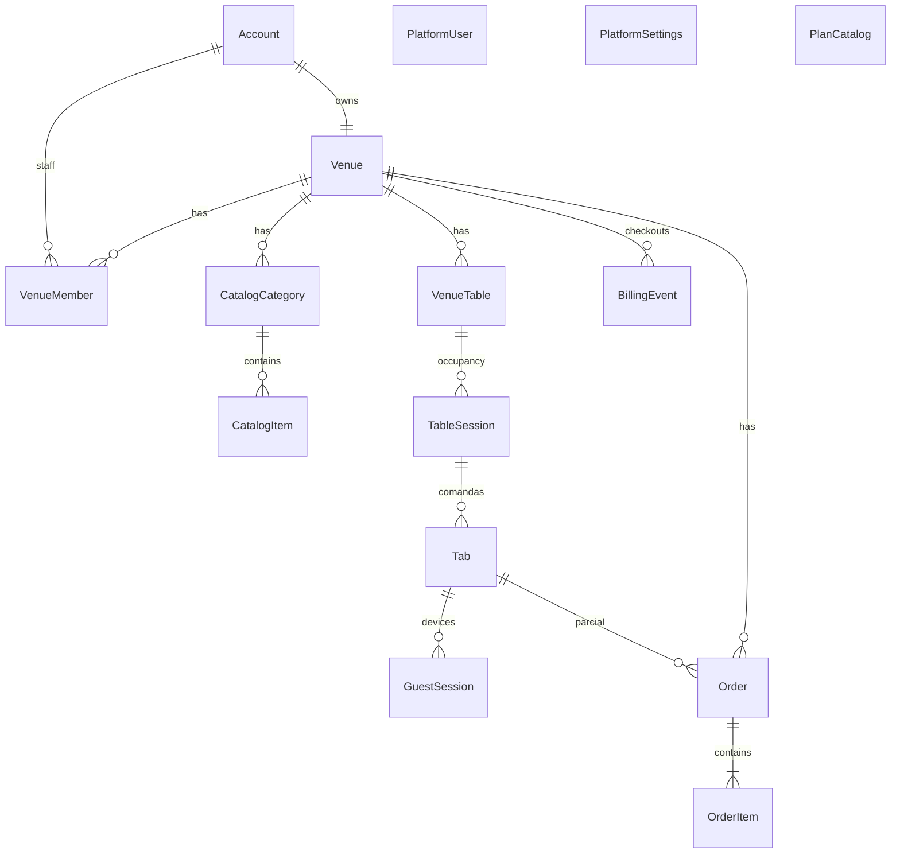

# Modelo de dados

Convenções: UUID interno; `slug` kebab-case único; `public_id` string opaca 10–16 chars; timestamps UTC; dinheiro em **centavos** (`price_cents`).

## Entidades — fatia 1 (cardápio)

### Account

Login do dono.

- `id`, `email` UNIQUE, `password_hash`, `created_at`

### Venue

- `id`, `owner_account_id` → Account
- `name`, `slug` UNIQUE, `public_id` UNIQUE
- `plan`: id do catálogo (`cardapio`, `auto_atendimento` ou SKU criado no console). Sem CHECK nos dois ids seed.
- `planKind` na API: `cardapio` | `auto_atendimento` (o que o bar pode fazer)
- `subscription_status`: `trial` | `active` | `past_due` | `suspended`
- `accepts_orders`: true só no Auto atendimento com assinatura válida
- `trial_ends_at`, `current_period_ends_at` (vigência paga)
- `created_at`, `updated_at`

Um account possui **um** venue (1:1). `VenueMember` só no plano Auto atendimento.

### Cardápio

- **CatalogCategory** — `venue_id`, `name`, `sort_order`, `active`, timestamps
- **CatalogItem**
  - `venue_id`, `category_id`, `name`, `description`, `image_url` (http(s) ou `/v1/uploads/{uuid}.ext`)
  - `price_cents`, `sort_order`, `active`, `max_note_length` (default 80; UI na fatia pedido guest)

## Entidades — fatia 2 (pedidos)

### Order

- `id`, `venue_id`
- `status`: `pending` | `accepted` | `preparing` | `delivered` | `cancelled`
- `source`: `counter` | `guest`
- `table_id` (nullable → VenueTable)
- `table_label` (snapshot)
- `tab_id` nullable → Tab (obrigatório quando `source = guest`)
- `idempotency_key` (nullable; único por venue quando preenchido)
- `note`
- timestamps

### OrderItem

- `id`, `order_id`, `venue_id`
- `catalog_item_id` (nullable se o item do cardápio for apagado)
- `name_snapshot`, `unit_price_cents_snapshot`, `qty`, `note`

## Entidades — fatia 3 (mesas)

### VenueTable

- `id`, `venue_id`
- `label` (ex. "Mesa 4", "Balcão") — único por venue
- `sort_order`, `active`, timestamps

No máximo **15 mesas ativas** por venue no plano Auto atendimento.

## Entidades — fatia 4 (equipe + comanda)

### VenueMember

Garçom vinculado ao venue (mesmo login do painel).

- `id`, `venue_id` → Venue, `account_id` → Account
- `role`: `staff` (owner continua via `venues.owner_account_id`)
- `name`, `active`, timestamps

Máximo **5 membros staff ativos** por venue no plano Auto atendimento.

## Entidades — fatia 6 (comandas individuais)

### TableSession

Ocupação da mesa + PIN do grupo.

- `id`, `venue_id`, `table_id` → VenueTable
- `pin_hash` (bcrypt, 4 dígitos)
- `status`: `open` | `closed`
- `closed_at`, timestamps

No máximo **uma** sessão `open` por mesa.

### Tab (comanda pessoal)

- `id`, `venue_id`, `table_id`, `table_session_id` → TableSession
- `guest_name`, `guest_phone` (só dígitos)
- `status`: `open` | `closed`
- `closed_at`, timestamps

Várias tabs `open` por sessão. Telefone único entre as `open` da mesma sessão (retoma a conta noutro aparelho).

### TableClaim

Como na fatia 4; `table_session_id` preenchido no redeem. **Não** cria a tab pessoal.

### GuestSession

- `id`, `venue_id`, `table_session_id` (obrigatório)
- `tab_id` (nullable até nome+telefone)
- `expires_at`, timestamps

### Order

- `tab_id` nullable → Tab (parcial da pessoa; pedido `guest` na fatia 7)

## Entidades — fatia 11 (console SaaS)

### PlatformUser

Operador EaiMesa. Tabela **separada** de `accounts`.

- `id`, `email` UNIQUE, `password_hash`, `name`, `active`, `created_at`

### PlatformSettings

Uma linha `id=default`: `trial_days`, `paid_period_days`.

### PlanCatalog

Catálogo vendável. `id` = slug do SKU (3–48; kebab ou underscore, para o seed `auto_atendimento`). Não está mais limitado aos dois ids seed.

- `kind`: `cardapio` | `auto_atendimento` — feature gate (pedido/garçom só no auto)
- `name`, `price_cents`, `promo_price_cents` (nullable; se preenchido e menor que o cheio, vitrine e checkout usam a promo)
- `blurb`, `features` (json), `listed`, `sort_order`

`GET /v1/billing/plans` lê daqui. Landing, cadastro e checkout não usam só a constante do código. Sem DELETE: `listed=false` esconde. Máximo 12 linhas.

### BillingEvent

Histórico do checkout stub.

- `venue_id`, `plan`, `plan_name`, `method`, `amount_cents`, `provider`, `status`, `created_at`

## Entidades — planejadas

- **AuditLog** — `venue_id`, `actor_type`, `actor_id`, `action`, `metadata_json`

## Índices críticos

- `venues(slug)` UNIQUE
- `venues(public_id)` UNIQUE
- `accounts(email)` UNIQUE
- `catalog_categories(venue_id, sort_order)`
- `catalog_items(venue_id, category_id)`
- `orders(venue_id, status, created_at)`
- `order_items(order_id)`
- `venue_tables(venue_id, sort_order)`
- `venue_tables(venue_id, label)` UNIQUE
- `venue_members(venue_id, account_id)` UNIQUE
Postgres (Fastify): `UNIQUE (table_id) WHERE status = open`. MySQL (Laravel, [ADR-016](../decisions/ADR-016-laravel-mysql.md)): coluna gerada `open_table_id` UNIQUE.

- `table_sessions(table_id) WHERE status = open` UNIQUE
- `tabs(table_session_id, guest_phone) WHERE status = open` UNIQUE
- `orders(venue_id, idempotency_key) WHERE idempotency_key IS NOT NULL` UNIQUE
- `platform_users(lower(email))` UNIQUE
- `billing_events(created_at DESC)`
- `billing_events(venue_id, created_at DESC)`

## Regras de negócio

1. CRUD de catálogo e pedidos só com `venue_id` da sessão do dono.
2. Menu público: `active = true` em categoria e item.
3. DELETE categoria com itens → `CATEGORY_NOT_EMPTY`.
4. `OrderItem` sempre grava snapshot de preço/nome; o cliente **não** envia preço.
5. Pedido público pelo slug **exige** comanda pessoal `open` (fatia 7). Slug sozinho não autoriza.
6. Pedido de balcão com `table_id` só aceita mesa **ativa** do mesmo venue; grava snapshot do rótulo.
7. PIN join casa o PIN com uma **TableSession** `open`.
8. Nome+telefone abre ou retoma comanda pessoal na sessão.
9. Encerrar mesa só se todas as comandas da sessão estão `closed`. Revoga sessões da comanda ao fechá-la.
10. `Idempotency-Key` repetida no mesmo venue devolve o mesmo pedido guest.
11. Cookie `eaimesa_platform` não autoriza `/v1/owner/*` nem guest; cookie do dono não autoriza `/v1/platform/*`.

## Diagrama ER

## Postgres RLS (recomendado fase 1.5)

Política por `venue_id` em tabelas operacionais quando usar connection pool com `SET app.venue_id`.
