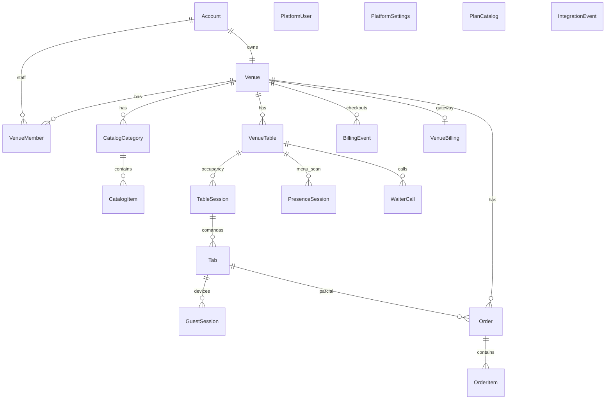

# Modelo de dados

Convenções: UUID interno; `slug` kebab-case único; `public_id` string opaca 10–16 chars; timestamps UTC; dinheiro em **centavos** (`price_cents`).

## Entidades — fatia 1 (cardápio)

### Account

Login do dono.

- `id`, `email` UNIQUE, `password_hash`, `created_at`

### Venue

- `id`, `owner_account_id` → Account
- `name`, `slug` UNIQUE, `public_id` UNIQUE
- `plan`: id do catálogo (`cardapio`, `auto_atendimento` ou SKU criado no console). Sem CHECK nos dois ids seed.
- `planKind` na API: `cardapio` | `auto_atendimento` (o que o estabelecimento pode fazer)
- `subscription_status`: `trial` | `active` | `past_due` | `suspended`
- `accepts_orders`: true só no Auto atendimento com assinatura válida
- `staff_can_close_tabs` (default true): se false, garçom não fecha comanda/mesa (caixa e dono sim)
- `require_shift_on_open_cash` / API `requireShiftOnOpenCash` (default false): se true, abrir o caixa exige a escala (garçom/caixa; painel de fora) ([ADR-031](../decisions/ADR-031-escala-abrir-caixa.md))
- `representative` (JSON/API camelCase): responsável / pagador Asaas — `name`, `cpfCnpj`, `email`, `phone`, `postalCode`, `addressNumber` ([ADR-025](../decisions/ADR-025-responsavel-configuracoes.md)). No cadastro entram só `name` + `cpfCnpj`; o restante pode faltar até Configurações → Responsável.
- `trial_ends_at`, `current_period_ends_at` (vigência paga)
- Sem tabela de períodos: um pagamento soma `paid_period_days` (default 30) no **fim da cobertura atual** — `max(agora, trial_ends_at, current_period_ends_at)` — ver [ADR-019](../decisions/ADR-019-vigencia-empilhada.md).
- Console (`PATCH /v1/platform/venues/{id}`): operador pode adiantar/estender essas datas. Sem `subscriptionStatus` no body, a API recalcula o status (exceto `suspended`). Não sincroniza o gateway.
- `created_at`, `updated_at`

Um account possui **um** venue (1:1). `VenueMember` só no plano Auto atendimento.

### Cardápio

- **CatalogCategory** — `venue_id`, `name`, `sort_order`, `active`, timestamps
- **CatalogItem**
  - `venue_id`, `category_id`, `name`, `description`, `image_url` (http(s) ou `/v1/uploads/{uuid}.ext`)
  - `price_cents`, `sort_order`, `active`, `max_note_length` (default 80; UI na fatia pedido guest)

## Entidades — fatia 2 (pedidos)

### Order

- `id`, `venue_id`
- `status`: `pending` | `accepted` | `preparing` | `delivered` | `cancelled`
- `source`: `counter` | `guest`
- `table_id` (nullable → VenueTable)
- `table_label` (snapshot)
- `tab_id` nullable → Tab (obrigatório quando `source = guest`; no `counter`, preenchido quando o staff lança na comanda)
- `idempotency_key` (nullable; único por venue quando preenchido)
- `note`
- timestamps

### OrderItem

- `id`, `order_id`, `venue_id`
- `catalog_item_id` (nullable se o item do cardápio for apagado)
- `category_id` (snapshot da categoria no momento do pedido; Kanban Painel filtra por isto)
- `name_snapshot`, `unit_price_cents_snapshot`, `qty`, `note`

## Entidades — fatia 3 (mesas)

### VenueTable

- `id`, `venue_id`
- `label` (ex. "Mesa 4", "Balcão") — único por venue
- `sort_order`, `active`, timestamps

No máximo **15 mesas ativas** por venue (Cardápio e Auto atendimento).

## Entidades — fatia 4 (equipe + comanda)

### VenueMember

Garçom vinculado ao venue (mesmo login do painel).

- `id`, `venue_id` → Venue, `account_id` → Account
- `role`: `staff` (garçom) | `cashier` (caixa) | `panel` (Kanban da estação). Owner continua via `venues.owner_account_id`. JWT do cookie é `staff` para os três.
- `name`, `active`, timestamps

### VenueMemberCategory (fatia 14)

Pivot `venue_member_id` + `catalog_category_id`. Só faz sentido quando `role = panel`. O Kanban daquele login mostra itens dessas categorias.

Máximo **5 membros ativos** (garçom + caixa + painel) por venue no plano Auto atendimento. Caixa usa `/garcom` e sempre encerra comanda/mesa. Garçom só encerra se `venues.staff_can_close_tabs` for true ([ADR-021](../decisions/ADR-021-caixa-encerra-comanda.md)). Painel nunca encerra; só o Kanban filtrado ([ADR-024](../decisions/ADR-024-kanban-painel-categorias.md)).

## Entidades — fatia 6 (comandas individuais)

### TableSession

Ocupação da mesa + PIN do grupo.

- `id`, `venue_id`, `table_id` → VenueTable
- `waiter_member_id` nullable → VenueMember: quem abriu a ocupação (taxa de serviço no financeiro — [ADR-032](../decisions/ADR-032-taxa-garcom-mesa.md))
- `pin_hash` (bcrypt) e `pin_display` (criptografado, para mostrar o PIN a quem já está na mesa)
- `status`: `open` | `closed`
- `closed_at`, timestamps

No máximo **uma** sessão `open` por mesa.

### Tab (comanda pessoal)

- `id`, `venue_id`, `table_id`, `table_session_id` → TableSession
- `guest_name`, `guest_phone` (só dígitos)
- `status`: `open` | `closed`
- `closed_at`, timestamps

Várias tabs `open` por sessão. Telefone único entre as `open` do **bar** (`open_venue_phone`): cadastrar o mesmo número com comanda ainda aberta → 409 `TAB_ALREADY_OPEN`.

### TableClaim

Como na fatia 4; `table_session_id` preenchido no redeem. **Não** cria a tab pessoal.

### GuestSession

- `id`, `venue_id`, `table_session_id` (obrigatório)
- `tab_id` (nullable até nome+telefone)
- `expires_at`, timestamps

### Order

- `tab_id` nullable → Tab (parcial da pessoa; pedido `guest` na fatia 7)

## Entidades — fatia 11 (console SaaS)

### PlatformUser

Operador EaiMesa. Tabela **separada** de `accounts`.

- `id`, `email` UNIQUE, `password_hash`, `name`, `active`, `created_at`
- Seed: um bootstrap (`ops@eaimesa.local`). Novos operadores: `POST /v1/platform/users` (cookie platform). Sem cadastro público.

### PlatformSettings

Uma linha `id=default`: `trial_days`, `paid_period_days`.

### PlanCatalog

Catálogo vendável. `id` = slug do SKU (3–48; kebab ou underscore, para o seed `auto_atendimento`). Não está mais limitado aos dois ids seed.

- `kind`: `cardapio` | `auto_atendimento` — feature gate (pedido/garçom só no auto)
- `name`, `price_cents`, `promo_price_cents` (nullable; se preenchido e menor que o cheio, vitrine e checkout usam a promo)
- `blurb`, `features` (json), `listed`, `sort_order`

`GET /v1/billing/plans` lê daqui. Landing, cadastro e checkout não usam só a constante do código. Sem DELETE: `listed=false` esconde. Máximo 12 linhas. `gateway` no payload vem do driver (`stub` | `asaas`), não do catálogo.

### BillingEvent

Histórico de checkout (stub e Asaas).

- `venue_id`, `plan`, `plan_name`, `method`, `amount_cents`
- `provider` (`stub` | `asaas` | futuro)
- `provider_ref` nullable — id da cobrança no provedor
- `status`: `pending` | `success` | `failed`
- `created_at`

Não guardar CPF/CNPJ nem PAN. O front envia pagador + cartão no POST de checkout (cartão); a API encaminha ao Asaas e descarta o PAN.

### VenueBilling

1:1 com o venue. Expõe `pendingCheckout` em `GET /v1/billing/me` (`url`, `plan`, `method`, `amountCents`).

- `venue_id` UNIQUE
- `provider`
- `customer_id`, `subscription_id`, `checkout_id` — ids do Asaas
- `credit_card_token` (cifrado), `card_last4`, `card_brand` — espelho do método **default**; nunca PAN/CVV
- `scheduled_plan`, `scheduled_plan_at` — downgrade agendado ([ADR-028](../decisions/ADR-028-assinatura-recorrente-planos.md))
- `pending_plan`, `pending_method`, `pending_amount_cents`, `pending_event_id`, `checkout_url`

Pendente some quando o webhook confirma.

### VenuePaymentMethod

N cartões tokenizados por venue (máx. 5). [ADR-028](../decisions/ADR-028-assinatura-recorrente-planos.md).

- `venue_id`, `provider`
- `credit_card_token` cifrado, `card_last4`, `card_brand` nullable
- `is_default` — o que a subscription Asaas usa; ao marcar default o front mostra “assinatura atualizada”

Front: `GET /v1/billing/me` → `savedCards` / `savedCard`; CRUD em `/v1/billing/cards`.

### IntegrationEvent (fatia 16)

Auditoria genérica de integrações (webhooks inbound primeiro). [ADR-027](../decisions/ADR-027-integration-events.md).

- `id` UUID
- `integration` — ex. `asaas`
- `kind` — `webhook` (outros no futuro)
- `direction` — `inbound` | `outbound`
- `event` nullable — nome bruto do provedor (`PAYMENT_RECEIVED`, …)
- `external_id` nullable — id do evento/cobrança no provedor
- `status` — `received` | `processed` | `ignored` | `failed`
- `payload` JSON — body do webhook (sem PAN/CVV; Asaas não envia)
- `meta` JSON nullable — `{ ip, headers }` com headers **sanitizados** (sem `asaas-access-token`, `authorization`, `cookie`)
- `error_message` nullable
- `created_at`

Lista no console (`GET /v1/platform/integration-events`) **não** devolve `payload`/`meta`. Front: `/admin/integracoes`.

## Entidades — planejadas

- **AuditLog** — `venue_id`, `actor_type`, `actor_id`, `action`, `metadata_json`

## Índices críticos

- `venues(slug)` UNIQUE
- `venues(public_id)` UNIQUE
- `accounts(email)` UNIQUE
- `catalog_categories(venue_id, sort_order)`
- `catalog_items(venue_id, category_id)`
- `orders(venue_id, status, created_at)`
- `order_items(order_id)`
- `venue_tables(venue_id, sort_order)`
- `venue_tables(venue_id, label)` UNIQUE
- `venue_members(venue_id, account_id)` UNIQUE
Postgres (Fastify): `UNIQUE (table_id) WHERE status = open`. MySQL/MariaDB (Laravel, [ADR-016](../decisions/ADR-016-laravel-mysql.md)): colunas nullable `open_table_id` / `open_session_phone` UNIQUE (NULL = fechado). Preenchidas no Eloquent — Hostinger rejeita coluna gerada com `IF`/`CASE` (erro 1901).

- `table_sessions(table_id) WHERE status = open` UNIQUE
- `tabs(venue_id, guest_phone) WHERE status = open` UNIQUE (`open_venue_phone`)
- `tabs(table_session_id, guest_phone) WHERE status = open` UNIQUE
- `orders(venue_id, idempotency_key) WHERE idempotency_key IS NOT NULL` UNIQUE
- `platform_users(lower(email))` UNIQUE
- `billing_events(created_at DESC)`
- `billing_events(venue_id, created_at DESC)`
- `billing_events(provider, provider_ref)` UNIQUE (NULLs repetíveis)
- `venue_billing(venue_id)` UNIQUE
- `integration_events(integration, created_at DESC)`
- `integration_events(integration, event, created_at DESC)`
- `integration_events(external_id)`
- `integration_events(status, created_at DESC)`

## Regras de negócio

1. CRUD de catálogo e pedidos só com `venue_id` da sessão do dono.
2. Menu público: `active = true` em categoria e item.
3. DELETE categoria com itens → `CATEGORY_NOT_EMPTY`.
4. `OrderItem` sempre grava snapshot de preço/nome; o cliente **não** envia preço.
5. Pedido público pelo slug **exige** comanda pessoal `open` (fatia 7). Slug sozinho não autoriza.
6. Pedido de balcão com `table_id` só aceita mesa **ativa** do mesmo venue; grava snapshot do rótulo. Com `tabId`, a mesa vem da comanda `open` e o pedido grava `tab_id`.
7. PIN join casa o PIN com uma **TableSession** `open`.
8. Nome+telefone abre a comanda pessoal. Se já houver comanda `open` com esse número no estabelecimento, 409 `TAB_ALREADY_OPEN`.
9. Encerrar mesa só se todas as comandas da sessão estão `closed`. Revoga sessões da comanda ao fechá-la.
10. `Idempotency-Key` repetida no mesmo venue devolve o mesmo pedido guest.
11. Cookie `eaimesa_platform` não autoriza `/v1/owner/*` nem guest; cookie do dono não autoriza `/v1/platform/*`. Os dois (e o guest) podem existir juntos no browser.
12. Plano `active` só no stub imediato ou no webhook. Redirect `?checkout=ok` não confirma.
13. CPF/CNPJ do pagador não é persistido. PAN/CVV não são persistidos nem logados. Token Asaas em `venue_billing` (cifrado) e em `venue_payment_methods` (até 5).
14. Webhook autenticado grava `integration_events` (body + meta sanitizado); token nunca entra em `meta`.

## Planejado — fatia 15 (chamar garçom)

- `venues.waiter_call_enabled`, `venues.waiter_call_ttl_minutes`
- `venue_tables.menu_code` (opaco, único no venue) → QR `/{slug}?mesa={menuCode}`
- `presence_sessions` + cookie `eaimesa_presence`
- `waiter_calls` (`open` \| `acked` \| `expired`)
- Detalhe: [ADR-026](../decisions/ADR-026-chamar-garcom-qr-mesa.md), [backend-waiter-call.md](../api/backend-waiter-call.md)

## Diagrama ER

## Postgres RLS (recomendado fase 1.5)

Política por `venue_id` em tabelas operacionais quando usar connection pool com `SET app.venue_id`.
