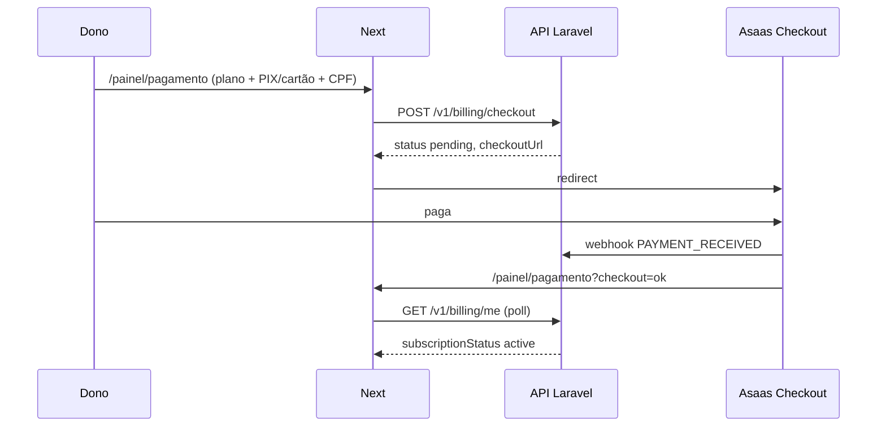

# Fatia 12 — Pagamento dos planos (checkout Asaas)

O dono paga a mensalidade em `/painel/pagamento`. A API **não** processa cartão: com `checkoutMode=hosted` o Asaas hospeda o checkout. O stub da [fatia 10](fatia-10-planos.md) continua quando `checkoutMode=immediate`.

Landing, `/preco` e `/cadastro` **não** pedem pagador. O trial segue igual. Depois do cadastro o front abre o produto (cardápio/pedidos). O checkout em `/painel/pagamento` (cartão e PIX) é destacado nos últimos 3 dias do trial ou se a assinatura estiver `past_due`.

## Inclui

- Ler `GET /v1/billing/plans` e `GET /v1/billing/me` → `gateway` (`provider`, `checkoutMode`, `methods`, `requiresPayer`, `available`)
- `checkoutMode === 'immediate'`: fluxo da fatia 10 (`{ plan, method }`, `status: success`). Sem PAN. Payer opcional.
- `checkoutMode === 'hosted'`: nome + CPF/CNPJ obrigatórios; e-mail (default da conta) e telefone opcionais. Sem número de cartão, validade, CVV nem “copia PIX”
- `POST /v1/billing/checkout` com `{ plan, method: "card"|"pix", payer }`
- `status: pending` + `checkoutUrl` → `window.location.assign(checkoutUrl)`
- Volta em `?checkout=ok|cancel|expired`: espera / cancelado / expirado. **`ok` não marca pago**
- Poll `GET /v1/billing/me` a cada ~3s até `venue.subscriptionStatus === 'active'` (para em erro ou ~2 min)
- Vigência: 30 dias a partir do fim da cobertura atual ([ADR-019](../decisions/ADR-019-vigencia-empilhada.md)), não a partir do instante do pagamento
- `pendingCheckout.url` → botão “continuar pagamento”
- `gateway.available === false`: aviso e não chama checkout
- Erros: `PAYER_REQUIRED` 400, `PAYMENT_UNAVAILABLE` 503, `PAYMENT_GATEWAY_ERROR` 502, `PLAN_DOWNGRADE_LOCKED` 409
- Painel: banner + item **Pagamento** nos últimos 3 dias do trial (`TRIAL_ENDING_SOON_DAYS`) ou `past_due`. Cadastro **não** redireciona ao checkout

## Não inclui

- PAN / CVV / token de cartão no Next nem na API
- Prorrata, NF, cupom, reembolso self-serve
- Pagamento da conta do cliente no bar
- Pedir pagador no cadastro ou na landing

## Superfície

| Path | Quem | O que muda |
|------|------|------------|
| `/painel/pagamento` | Dono | Hosted: pagador + redirect. Immediate: stub. Nav/banner no fim do trial |
| `/painel/bar` | Dono | Mesmo `BillingPanel` (pagamento antecipado) |
| `/`, `/preco`, `/cadastro` | Visitante | Sem pagador; trial inalterado; cadastro vai ao produto |

## Contrato

Ver [endpoints](../api/endpoints.md) e [ADR-018](../decisions/ADR-018-payment-gateway-asaas.md).

