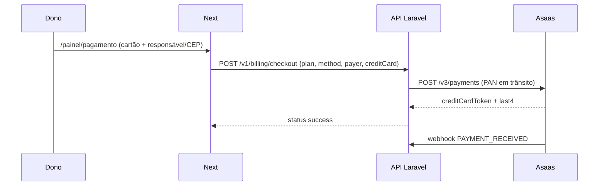

# Fatia 12 — Pagamento dos planos (checkout Asaas)

O dono paga a mensalidade em `/painel/pagamento`. **Cartão** é digitado no painel e o Laravel encaminha ao Asaas. **PIX** usa checkout hospedado. O stub da [fatia 10](fatia-10-planos.md) continua quando `checkoutMode=immediate`.

Landing, `/preco` e `/cadastro` **não** pedem pagador. O trial segue igual. Depois do cadastro o front abre o produto (cardápio/pedidos). O checkout em `/painel/pagamento` (cartão e PIX) é destacado nos últimos 3 dias do trial ou se a assinatura estiver `past_due`. Callbacks PIX usam `?checkout=` na mesma rota. Pagador vem do **responsável** (`venue.representative`) — [ADR-025](../decisions/ADR-025-responsavel-configuracoes.md).

## Inclui

- Ler `GET /v1/billing/plans` e `GET /v1/billing/me` → `gateway` (`provider`, `checkoutMode`, `methods`, `requiresPayer`, `available`)
- `checkoutMode === 'immediate'`: `{ plan, method, creditCard? }`, `status: success`. Stub ignora o cartão.
- `method: card` + Asaas: nome, CPF/CNPJ, CEP, número do endereço + número/validade/CVV no painel. `POST /v1/billing/checkout` com `{ plan, method, payer, creditCard }`. API cobra no Asaas e grava `creditCardToken` (não o PAN)
- `method: pix` + Asaas: pagador; `status: pending` + `checkoutUrl` → redirect
- Volta PIX em `?checkout=ok|cancel|expired`: espera / cancelado / expirado. **`ok` não marca pago**
- Cartão aprovado: `status: success` na hora (webhook pode repetir; é idempotente)
- Poll `GET /v1/billing/me` a cada ~3s até `venue.subscriptionStatus === 'active'` (PIX)
- Vigência: 30 dias a partir do fim da cobertura atual ([ADR-019](../decisions/ADR-019-vigencia-empilhada.md))
- `pendingCheckout.url` → botão “continuar pagamento” (PIX)
- `gateway.available === false`: aviso e não chama checkout
- Erros: `PAYER_REQUIRED` 400, `CARD_REQUIRED` 400, `PAYMENT_UNAVAILABLE` 503, `PAYMENT_GATEWAY_ERROR` 502, `PLAN_DOWNGRADE_LOCKED` 409
- Painel: banner + item **Pagamento** nos últimos 3 dias do trial (`TRIAL_ENDING_SOON_DAYS`) ou `past_due`. Cadastro **não** redireciona ao checkout

## Não inclui

- Guardar PAN/CVV no banco ou em log
- Tokenização no browser (Asaas não oferece)
- Prorrata, NF, cupom, reembolso self-serve
- Pagamento da conta do cliente no estabelecimento
- Pedir pagador no cadastro ou na landing

## Superfície

| Path | Quem | O que muda |
|------|------|------------|
| `/painel/pagamento` | Dono | Cartão no form. PIX + redirect. Banner no fim do trial. Pré-fill do responsável |
| `/painel/configuracoes/responsavel` | Dono | Cadastro do pagador Asaas |
| `/`, `/preco`, `/cadastro` | Visitante | Sem pagador; trial inalterado; cadastro vai ao produto |

## Contrato

Ver [endpoints](../api/endpoints.md) e [ADR-020](../decisions/ADR-020-cartao-no-painel.md).

