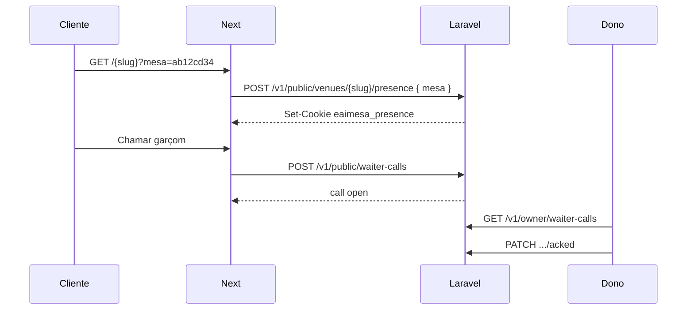

# Fatia 15 — Chamar garçom (QR da mesa, plano Cardápio)

Cliente no plano **Cardápio** escaneia o QR **daquela mesa**, ganha uma sessão curta no celular e pode **chamar o garçom**. O dono vê no painel qual mesa chamou. Feature **desligável** e com **TTL configurável**.

Não abre comanda, PIN nem pedido. Ver [ADR-026](../decisions/ADR-026-chamar-garcom-qr-mesa.md).

## Inclui

- QR da mesa: `/{slug}?mesa={menuCode}` (código opaco da mesa)
- Cookie `eaimesa_presence` após o scan (TTL do bar)
- Botão **Chamar garçom** no `/{slug}` só com presença válida e feature ligada
- `/painel/chamados` — fila de mesas que chamaram (poll)
- Configurações: ligar/desligar + minutos de validade da sessão
- Mesas no plano Cardápio (CRUD) para exportar QR com `?mesa=`
- Contrato API: [backend-waiter-call.md](../api/backend-waiter-call.md)

## Não inclui

- Pedido / comanda / PIN / claim
- App nativo / push / SSE (poll)
- Staff `/garcom` no plano Cardápio (dono atende em `/painel/chamados`)
- Mapa do salão

## Fluxo

1. Dono liga **Chamar garçom**, define TTL (ex. 120 min), cadastra mesas, exporta QR por mesa.
2. Cliente escaneia → presença na mesa → vê o botão.
3. Toca **Chamar garçom** → aparece em `/painel/chamados`.
4. Dono marca **Atendido**.
5. Sem `?mesa=` ou feature off ou TTL vencido → só cardápio leitura.

## Configuração (UI)

| Campo | Onde |
|-------|------|
| Ligar / desligar | Configurações → Chamada ao garçom (ou Meu bar) |
| Validade da sessão (minutos) | Mesmo formulário |
| Mesas + QR | `/painel/mesas` (liberado no Cardápio para esta fatia) |

## Conferência

- QR Mesa 3 contém `?mesa=` distinto do QR Mesa 4.
- Scan cria cookie; botão aparece.
- Chamada lista a mesa certa no painel.
- Feature off → sem botão / API 403 `FEATURE_DISABLED`.
- TTL baixo → após expirar, botão some até novo scan.
