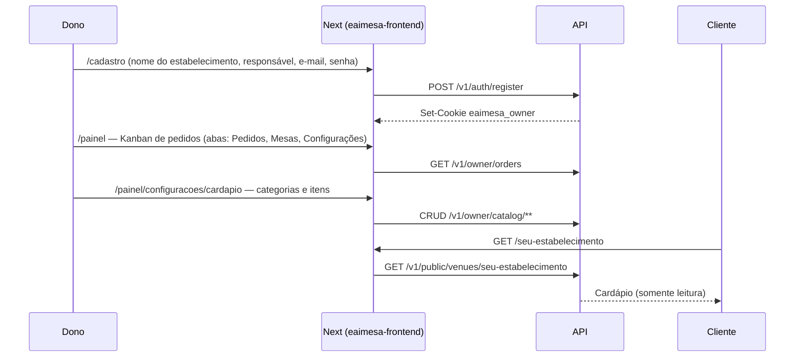
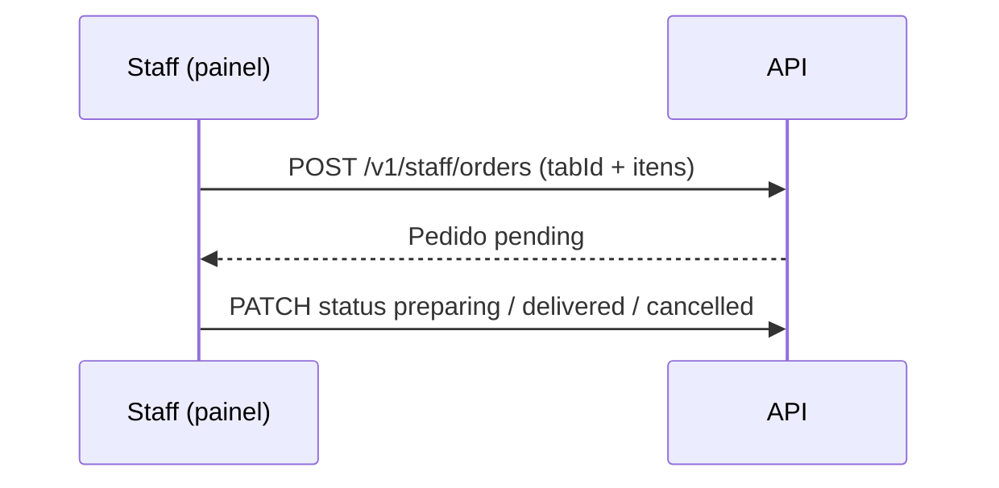
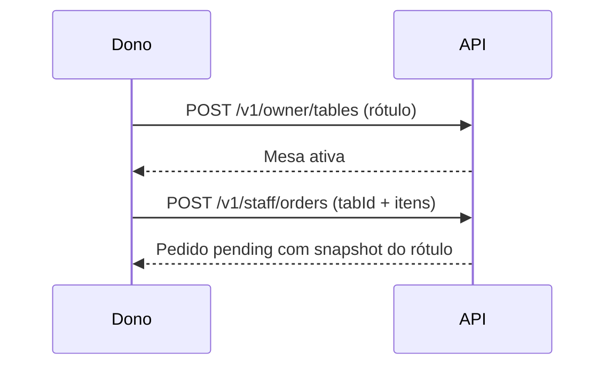
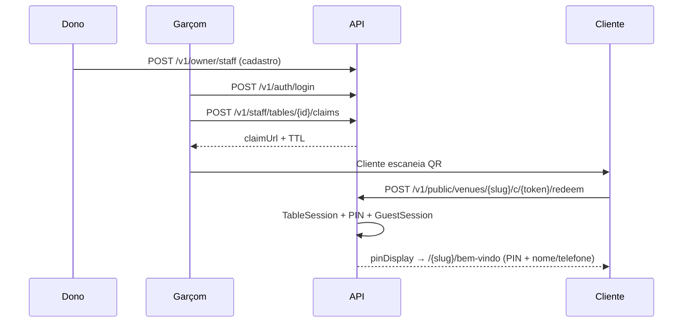
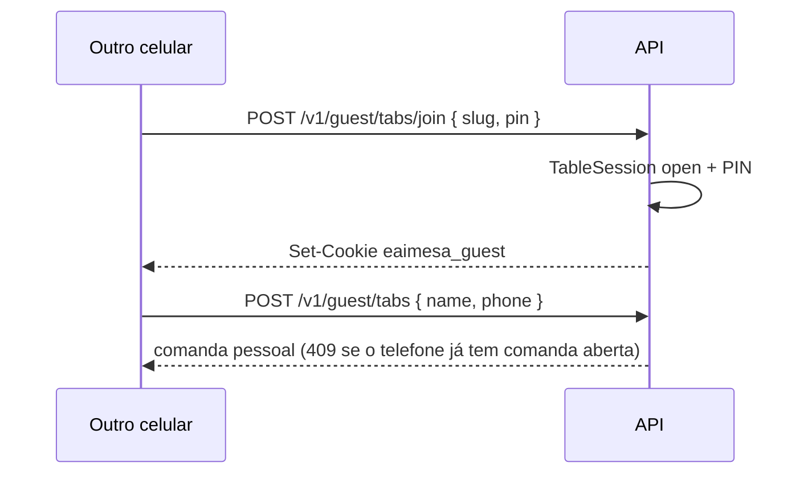
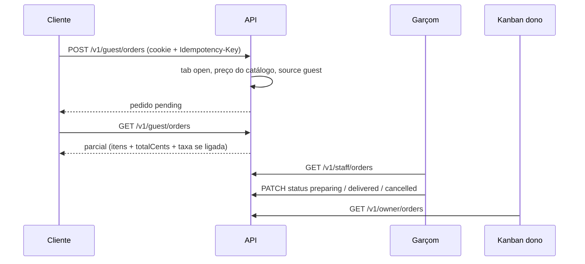

# Fluxos

## 0. Fatia 1 — publicar e ler o cardápio

Detalhe em [fatia-01-cardapio.md](fatia-01-cardapio.md).



1. Dono cria conta + venue (nome; slug gerado a partir do nome).
2. Monta categorias e itens (preço mascarado **R$** no painel; centavos no servidor) em **Configurações → Cardápio**.
3. Comparte `https://eaimesa.com.br/{slug}` (QR fixo na mesa, Instagram, balcão) — **só cardápio**.
4. Cliente abre `/{slug}`: navega por **grupos**, toca o item para ver **foto** e descrição. **Não pede pelo link** (comanda exige QR do garçom). Pedidos lançados pelo staff: mesa em `/garcom` → comanda. Mesas + export do QR fixo: **Configurações → Mesas**.

## 0b. Fatia 2 — fila Kanban (balcão)

Detalhe em [fatia-02-pedidos.md](fatia-02-pedidos.md). O cliente **ainda não** pede pelo slug.



1. Staff entra (`/login`) e cai em `/painel/pedidos` (ou clica a aba **Pedidos**).
2. O Kanban só avança status. Lançar itens: `/garcom` → mesa → comanda.
3. Avança o card nas colunas até **Entregues**.

## 0c. Fatia 3 — cadastrar o salão

Detalhe em [fatia-03-mesas.md](fatia-03-mesas.md). Claim por mesa continua **fora**.



1. Dono abre **Mesas** e cadastra até 15 ativas (ex. Balcão, Mesa 1…10).
2. Exporta o **QR fixo** de cada mesa (destino: cardápio `/{slug}`) e cola no salão.
3. Pedido de balcão: mesa ocupada em `/garcom`, na comanda da pessoa.
4. QR/claim do **garçom** (abre comanda): garçom em `/garcom` ou dono autenticado — fatia 4.

## 1. Onboarding do estabelecimento (B2B)

1. Dono cria conta (e-mail + senha + nome e CPF do responsável).
2. Cadastra venue: **nome**; o slug sai do nome (`seu-estabelecimento`, ou `seu-estabelecimento-2` se já existir). URL do cardápio não é editável.
3. Escolhe um plano do catálogo (tipo Cardápio ou Auto atendimento). Cadastro entra em `trial` (7 dias) e o front abre o **produto** (cardápio ou pedidos). Landing/cadastro **não** pedem cartão (nome e CPF do responsável já entram no cadastro). O painel destaca `/painel/pagamento` (cartão e PIX) nos **últimos 3 dias** do trial ou se o status for `past_due`. Stub marca `active` na hora; Asaas só depois do webhook.
4. Sistema gera `public_id` opaco interno; a URL pública é o slug.
5. Dono cadastra cardápio (fatia 1), fila (fatia 2) e mesas (fatia 3).
6. Divulga `/{slug}` — **não** o claim.

## 2. Abertura da mesa (garçom → cliente)



1. Dono cadastra garçons, caixas e (se quiser) painéis da cozinha/bar em **Configurações → Equipe** (`/painel/configuracoes/equipe`).
2. Garçom entra em `/login` → `/garcom`, escolhe mesa, mostra QR (countdown ~3 min). Painel entra no mesmo `/login` → `/painel/pedidos` (só o Kanban das categorias marcadas).
3. Cliente escaneia → redeem → PIN da mesa + **nome e telefone** (comanda pessoal).
4. O quadro do garçom lista os nomes na mesa e, ao toque, abre a parcial. Não gera outro QR se a mesa já está ocupada.
5. Pedido pelo cardápio grava `tab_id` da comanda pessoal (fatia 7).

## 3. Outros celulares na mesa (fatia 5)

Detalhe em [fatia-05-pin-join.md](fatia-05-pin-join.md).



1. Cliente abre `/{slug}` (QR fixo) ou `/{slug}/entrar`.
2. Informa o PIN de 4 dígitos da **mesa**.
3. Nome + telefone → comanda pessoal na mesma ocupação.
4. Garçom **não** precisa voltar.

## 4. Pedido (fatia 7)

Detalhe em [fatia-07-pedido-guest.md](fatia-07-pedido-guest.md).



1. Comanda pessoal aberta no `/{slug}`.
2. Carrinho: itens + qty + nota opcional. Preço **não** vai no body.
3. Envia → `pending` no Kanban do **garçom** (`/garcom/pedidos`) e do dono.
4. Cliente vê a **parcial** da própria comanda (dialog **Parcial** no `/{slug}`, ou `/{slug}/comanda`).
5. Sem comanda: slug continua só leitura (401/403).

## 4b. Fila do garçom (fatia 8)

Detalhe em [fatia-08-fila-garcom.md](fatia-08-fila-garcom.md).

1. Garçom abre **Pedidos** em `/garcom/pedidos`.
2. Vê novos, aceita, manda preparar, marca entregue.
3. Lançar itens: **Mesas** → comanda → dialog (`POST /v1/staff/orders` com `tabId`).

## 5. Fechamento (fatia 6)

Detalhe em [fatia-06-comandas-individuais.md](fatia-06-comandas-individuais.md).

1. Caixa, dono ou garçom (se `staffCanCloseTabs`): confere o total (**A receber** / cupom) e `POST /v1/staff/tabs/{id}/close` — fecha **uma** comanda (revoga sessões daquela conta). Garçom sem permissão → 403 `CASHIER_REQUIRED`.
2. Mesma regra: `POST /v1/staff/tables/{id}/close` — encerra a **mesa** só se todas as comandas estão `closed`.
3. Próxima rodada na mesa = novo claim (novo PIN).
4. Fechar **caixa** (`/painel/caixa`, `/garcom/caixa`): `GET /v1/staff/cash-sessions/current` traz o esperado do turno (vendas + fundo + movimentações). Os campos já vêm preenchidos; o caixa corrige e `POST .../close`.
5. Config **Exigir caixa aberto** em Configurações → Financeiro (`finance.config.requireOpenCash`): sem turno aberto, QR e pedidos são recusados (`CASH_SESSION_REQUIRED`).
6. **Imprimir na térmica** (Chrome USB/serial, ESC/POS) manda o cupom direto na POS80 — não passa pelo diálogo A4. Se a taxa de serviço estiver ligada, o cupom traz o % e o total com taxa. Se o Mac já tiver a POS80 como impressora do sistema, pause essa fila para o Chrome usar o USB. **Impressora do sistema** fica para laser/PDF. Agente local de cozinha continua fora do MVP ([ADR-029](../decisions/ADR-029-cupom-escpos-usb.md)).

## 5b. Fatia 10 — planos e checkout stub

Detalhe em [fatia-10-planos.md](fatia-10-planos.md). Gateway Asaas: [fatia 12](fatia-12-pagamento-asaas.md).

```mermaid
sequenceDiagram
  participant D as Dono
  participant W as Next (eaimesa-frontend)
  participant API as API

  D->>W: /cadastro?plano={id do catálogo}
  W->>API: POST /v1/auth/register (plan)
  API-->>W: trial 7 dias
  D->>W: /painel/configuracoes/cardapio ou /painel/pedidos
  Note over D,W: nos últimos 3 dias do trial (ou past_due): banner no painel
  D->>W: /painel/pagamento (cartão ou PIX + valor)
  W->>API: POST /v1/billing/checkout {plan, method, payer?, creditCard?}
  alt stub
    Note over API: espera 2s (ignora cartão)
    API-->>W: status success, active
  else cartão Asaas
    Note over API: encaminha PAN ao Asaas; grava token
    API-->>W: status success, active
  else PIX Asaas
    API-->>W: status pending, checkoutUrl
    W->>D: redirect ao provedor
  end
```

1. Cadastro escolhe o plano (com o valor, ou de/por se houver promo); entra em `trial` (7 dias) e vai para o produto. Pagamento **não** abre no cadastro. Nos últimos 3 dias do trial (`TRIAL_ENDING_SOON_DAYS`) — ou com status `past_due` — o painel mostra banner para `/painel/pagamento`. Quem quiser pagar antes usa **Configurações → Pagamento**. Responsável em `/painel/configuracoes/responsavel`; no checkout Asaas o front omite `payer` se inalterado.
2. Stub (`immediate`): (~2s) aprova e grava `active`. `currentPeriodEndsAt` = `max(agora, trial_ends_at, current_period_ends_at) + paidPeriodDays`. Front envia o cartão no POST; o stub ignora.
3. Asaas cartão: form no painel envia `creditCard`; Laravel cobra e guarda token. PIX: redirect hosted. `?checkout=ok` não confirma.
4. Subir `kind` Cardápio → Auto atendimento: sempre, com **prorrata** (`upgradeQuotes`). Troca lateral (mesmo kind): sempre. Descer no meio da vigência **paga**: agendar (`schedule-downgrade`); imediato só depois do fim (ou no trial). Plano `active` no mesmo SKU: sem novo checkout.
5. Plano `kind=cardapio`: API responde 403 `PLAN_FEATURE` em equipe, pedidos, claim, PIN e comanda. **Mesas** (`/v1/owner/tables`) são liberadas para QR. O `/{slug}` não mostra PIN nem “Entrar para pedir”; `/entrar` redireciona ao cardápio.

## 5c. Fatia 11 — console SaaS

Detalhe em [fatia-11-console-saas.md](fatia-11-console-saas.md).

1. Operador entra em `/admin/login` (cookie `eaimesa_platform`). Sessão válida pula o form. Independente do cookie do estabelecimento (`eaimesa_owner`).
2. Dashboard: estabelecimentos, MRR estimado, checkouts (stub e Asaas). Status/plano em português (Em trial, Ativo, Cardápio…).
3. `/admin/bares`: lista com data de expiração; suspender / reativar; ajustar trial/vigência (`PATCH /v1/platform/venues/{id}` — admin; não mexe no Asaas).
4. `/admin/planos`: criar SKU, preço, promo; `GET /v1/billing/plans` alimenta landing, cadastro e checkout (de/por se houver promo).
5. `/admin/logs`: tail de `storage/logs` ([fatia 13](fatia-13-log-viewer.md)).
6. `/admin/integracoes`: webhooks Asaas ([fatia 16](fatia-16-integration-events.md)).
7. `/admin/equipe`: lista e cadastra operadores (`GET/POST /v1/platform/users`) — [fatia 17](fatia-17-platform-equipe.md). Sem tela pública de cadastro admin.

## 6. Venue suspenso (billing)

- `GET /{slug}` → cardápio + aviso “assinatura inativa”.
- `POST /guest/orders` → **402/403**.
- Tabs abertas ainda podem **fechar**.

Na fatia 1, `suspended` ainda mostra o cardápio (read-only) com aviso, se o status estiver setado.

## Estados da Tab

| Estado | Guest | Staff |
|--------|-------|-------|
| `open` | Comanda da pessoa | Parcial no dialog da mesa |
| `closed` | Precisa de nova comanda | Arquivo; mesa só encerra se todas closed |

## Impressora

No Kanban (`/painel/pedidos`, `/garcom/pedidos`): auto-print liga em **Configurações → Estabelecimento**. O botão **Configurar impressora** no card abre o picker USB/serial deste Chrome ([ADR-029](../decisions/ADR-029-cupom-escpos-usb.md)). Pedido novo em `pending` gera via ESC/POS; falha de print **não** cancela o pedido. Agente local (`print_pending` após `accepted`) continua fora do MVP.
